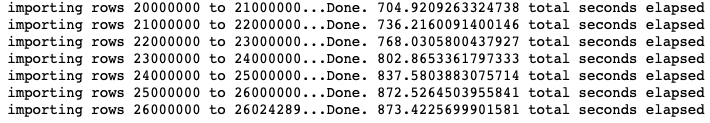
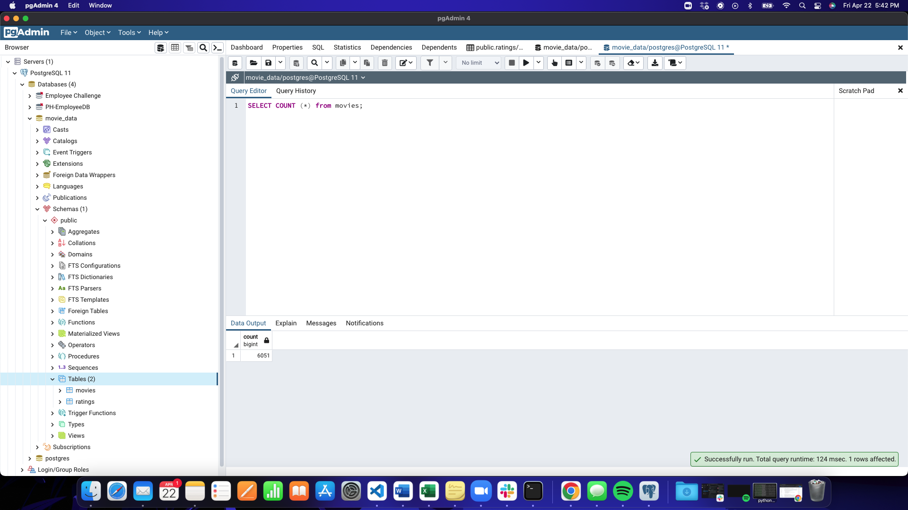

# Movies-ETL

## Purpose of Module 8: Extract, Transform, Load
The purpose of this module and challenge was to extract data from wikipedia, kaggle, and MovieLens files and clean the data. Some of the data was considered bad data and needed to be consolidated, i.e. clean the data by condensing similar columns together and eliminating any data that may hinder the overall data. Then we needed to refactor our code to create one function that takes in all three files and performs the ETL process by adding the data to a PostgreSQL database.

## Images from Module

Since I had some issues with this challenge, mainly with refactoring the code for cleaning the Kaggle data and creating the database, these pictures are from the module to present the similarities between the challenge and module.
